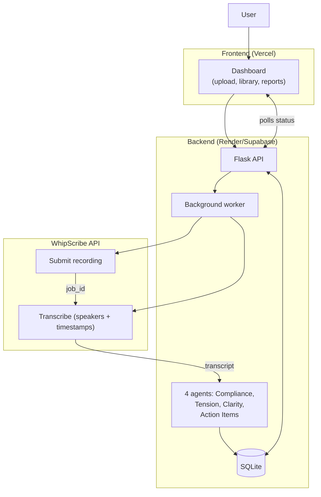

# CallCoach-AI × WhipScribe

[▶ Watch the 90-second demo](videos/demo/callcoach-demo-2026-09-28T15-11-37.webm)

Upload a recording, get a scorecard with evidence at the exact second.

## What it does

CallCoach-AI turns any founder-investor, customer-success, or sales call into a structured quality score with evidence pinned to the exact timestamp. Upload a file, paste a link, or record in the browser. WhipScribe transcribes it. Four AI agents score it. The report shows every flagged quote linked to the moment it was said.

Across multiple calls, the same pipeline shows whether quality is improving, stagnating, or repeating the same mistakes — and produces prescriptive coaching recommendations.


## Architecture

Two pieces. The dashboard is a static Next.js site on Vercel. The backend is a Flask API on Render (or Supabase) that does the heavy work.



### How a call flows

1. **Upload** — File, YouTube link, or browser recording
2. **Submit** — Backend sends to WhipScribe, returns `job_id`
3. **Transcribe** — Polls until done, fetches transcript with speakers + timestamps
4. **Score** — 4 AI agents evaluate: Compliance, Tension, Clarity, Action Items
5. **Report** — Scores + evidence with clickable timestamps

Every step stores results in SQLite. The dashboard reads from there.

### Why split frontend and backend?

Vercel Functions time out after 15 minutes. A transcription + scoring job can take up to 30 minutes, so the backend runs on Render (or Supabase Edge Functions) where long-running jobs work.

## Screenshots

| Dashboard | Trends | Coach | Speakers | Connections |
|-----------|--------|-------|----------|-------------|
|  |  |  |  |  |

## Quick start

```bash
# 1. Backend (Flask API)
cd apps/blacksujit/track-4  # or this directory if you cloned the standalone repo
python -m venv .venv && source .venv/bin/activate  # Windows: .venv\Scripts\activate
pip install -r requirements.txt
cp .env.template .env  # add your WHIPSKRIBE_API_KEY and GROQ_API_KEY
python app.py
# Health check: curl http://localhost:5000/api/health

# 2. Frontend (Next.js dashboard)
cd frontend
npm install
npm run dev:hmr    # webpack dev server with HMR
# Open http://localhost:3000

# 3. CLI (no servers needed)
python -m src.main --sample                     # offline demo with sample transcript
python -m src.main --file ./my-recording.mp3    # upload and analyze
python -m src.main --job-id <whipscribe-id>     # analyze an existing job

# 4. MCP server (for Claude Code / Cursor / ChatGPT)
python src/mcp_server.py
```

### Offline test (no API keys)

```bash
python e2e_test.py --offline          # full pipeline with sample transcript
python -m src.main --compare-sample   # multi-meeting trend demo
```

## Environment variables

| Variable | Required | Purpose |
|---|---|---|
| `WHIPSKRIBE_API_KEY` | yes | Transcription API key |
| `GROQ_API_KEY` | for LLM mode | GROQ API key for 4-agent scoring |
| `LLM_PROVIDER` | no | `groq` (default), `openai`, `anthropic` |
| `SLACK_WEBHOOK_URL` | no | Slack delivery |
| `NOTION_TOKEN`, `NOTION_DATABASE_ID` | no | Notion delivery |

See `.env.template` for all variables.

## Deploy

Frontend and backend deploy separately. See [DEPLOYMENT.md](DEPLOYMENT.md) for full details.

### Frontend (Vercel — deployed)

```bash
cd frontend
npm run build    # cross-env NODE_OPTIONS=--max-old-space-size=2048 next build --webpack
npm start
```

| Env var | Value |
|---|---|
| `NEXT_PUBLIC_API_URL` | Backend API URL (Render or Supabase) |

Live at: [https://callcoach-ai-dashboard.vercel.app](https://callcoach-ai-dashboard.vercel.app)

### Backend (Render or Supabase)

**Option A — Render (free tier)**

`render.yaml` and `Procfile` are configured. Set env vars in the Render dashboard:
- `WHIPSKRIBE_API_KEY`, `GROQ_API_KEY`, `FRONTEND_URL`, `CORS_ORIGINS`

**Option B — Supabase Edge Functions**

Already deployed. Redeploy via:
```bash
supabase functions deploy callcoach --project-ref lcendgcvqwgklhkbnxkx
```

> **Why not Vercel for the backend?** Transcription + scoring runs up to 30 minutes. Vercel Serverless Functions time out at 15. The backend needs a persistent worker (Render) or edge function (Supabase).

---

## The problem

Sarah is a customer-success manager at a B2B SaaS company. She reviews 15-20 customer calls per week. WhipScribe transcribes them — but the transcript is just text.

To assess call quality — did the rep ask the right questions? Make unbacked promises? Capture action items? — Sarah reads every transcript in full (30-60 min/week) and tracks issues in a separate doc. She misses things, feedback is delayed, and coaching is inconsistent.

**Cost:** 5-10 hours/week wasted on manual review. Missed compliance risks. Forgotten action items = lost revenue. No systematic way to track team improvement across calls.

## The solution

CallCoach keeps the meeting evidence, finds recurring issues across calls, detects metric direction, and produces prescriptive next actions.

1. **Score**: Upload a recording — WhipScribe transcribes, four AI agents score on Compliance, Tension, Clarity, and Action Items. Every flagged quote links to the exact second.
2. **Compare**: Analyze 2+ calls — deal velocity, momentum, recurring issue clusters, action-item lifecycle.
3. **Coach**: Prescriptive recommendations tied to evidence from specific calls.

---


## What works

- Real transcription via WhipScribe API (upload, poll, fetch result with speakers + timestamps)
- Four-agent LLM scoring (GROQ `openai/gpt-oss-120b`) with rule-based fallback
- Evidence-grounded quotes with verified timestamps
- Cross-call trend analysis: velocity, momentum, recurring issues, action-item lifecycle
- Speaker-level risk scoring and coaching insights
- Slack + Notion integrations with live validation
- MCP server with 4 tools for assistant integration
- CLI for offline pipeline execution
- Vercel production deployment with all 8 routes prerendered

## What doesn't work yet

- No real user has tested it — everything is engineer-verified
- Background jobs don't survive a restart (single daemon thread; needs a real queue)
- No authentication on the API
- SQLite on free tiers is ephemeral
- Cold starts on free Render/Supabase tiers (keep-alive cron recommended)

---

## Tech stack

| Layer | Technology |
|---|---|
| Frontend | Next.js 16, React 19, vanilla CSS |
| Backend | Python Flask, SQLite, gunicorn |
| Transcription | WhipScribe API |
| LLM | GROQ (openai/gpt-oss-120b), with OpenAI/Anthropic support |
| Deployment | Vercel (frontend), Render or Supabase (backend) |
| MCP | Python MCP server (stdlib) |

---

*Built on the [WhipScribe API](https://whipscribe.com/docs). Own account, own recordings.*
