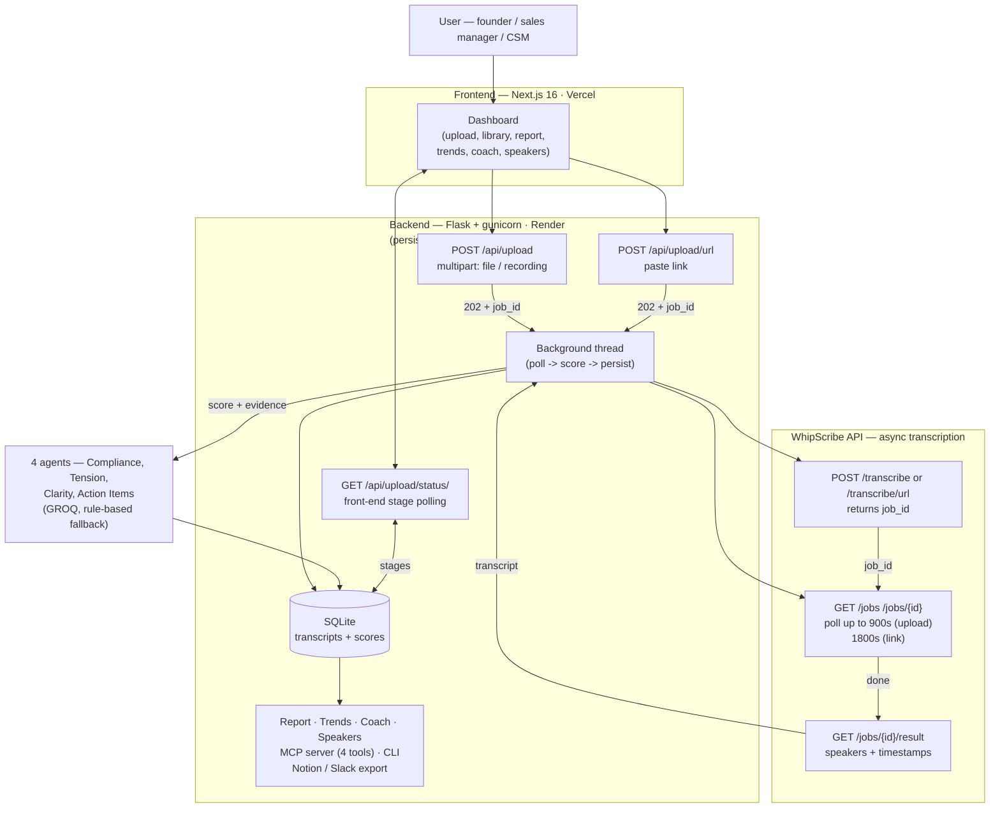
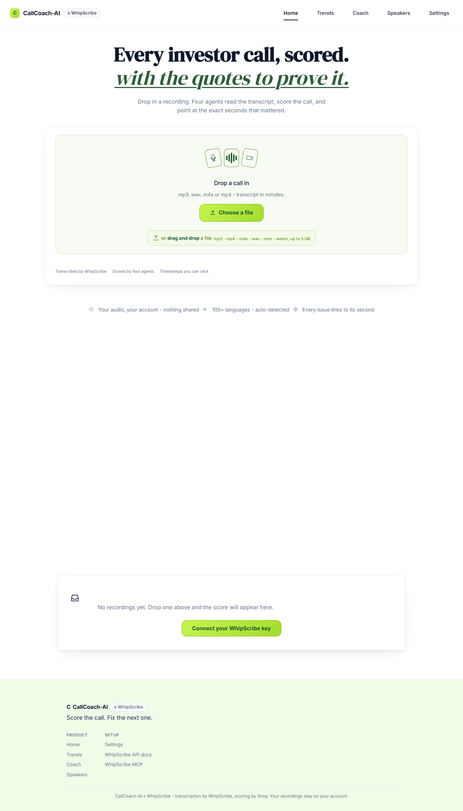
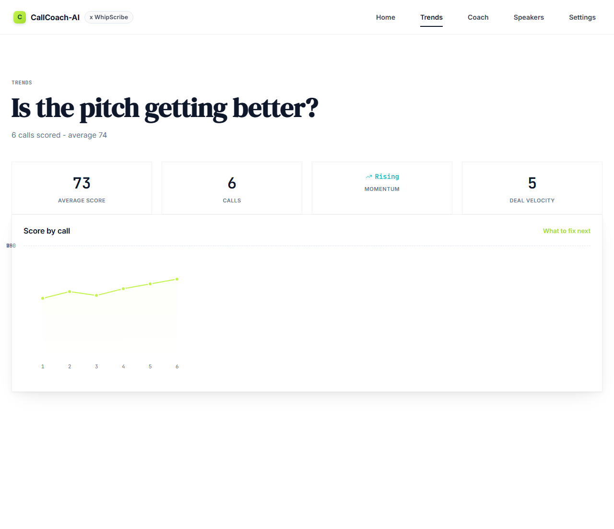
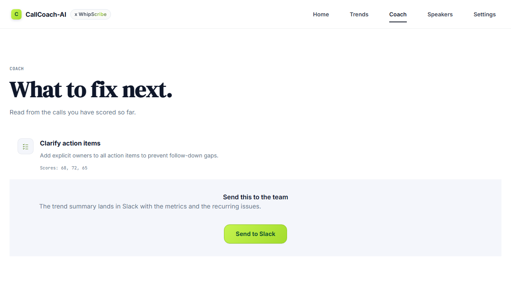
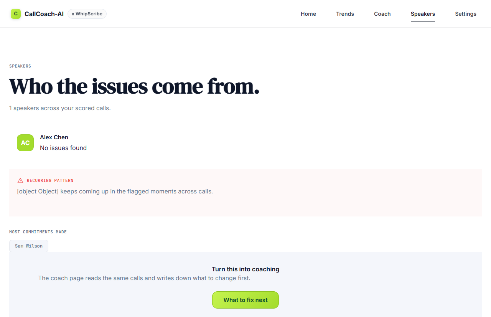
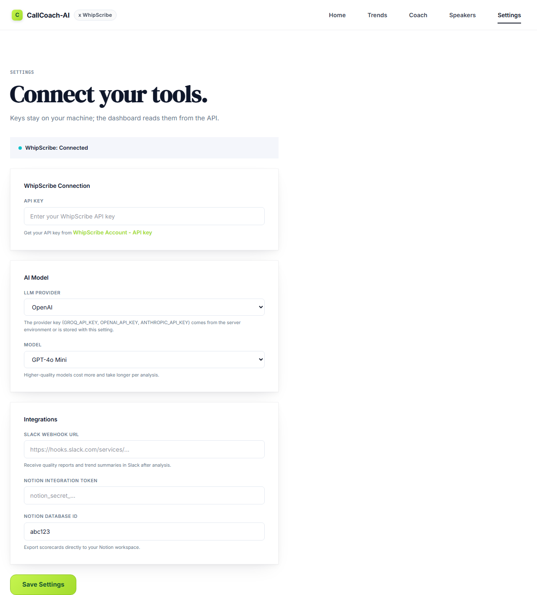

# CallCoach-AI × WhipScribe

[▶ Watch the 90-second demo](videos/demo/callcoach-demo-2026-09-28T15-11-37.webm)

Upload a recording, get a scorecard with evidence at the exact second.

## What it does

CallCoach-AI turns any founder-investor, customer-success, or sales call into a structured quality score with evidence pinned to the exact timestamp. Upload a file, paste a link, or record in the browser. WhipScribe transcribes it. Four AI agents score it. The report shows every flagged quote linked to the moment it was said.

Across multiple calls, the same pipeline shows whether quality is improving, stagnating, or repeating the same mistakes — and produces prescriptive coaching recommendations.


## Features

One recording in, one scored report out. Transcription is the on-ramp, not the
product — the product is the judgment.

### LLM as the judge

The transcript is not summarized. It is graded against a rubric by four
specialist agents, each a focused judge on one dimension:

- **Compliance** — were commitments, claims, and promises checked and tracked?
- **Tension** — where did a participant hedge, deflect, or tighten on valuation?
- **Clarity** — was the ask clear up front, the narrative consistent, the
  traction concrete?
- **Action Items** — what was promised, by whom, and will any of it land?

They score, they don't regurgitate the call.

### Four agents, one report

The four scores fold into a single scorecard: an overall number, four
category bars, the one **primary risk** (the issue that cost the most points),
and every flagged quote with its speaker and timestamp. Quotes that cannot be
matched to a real transcript segment are dropped — no fabricated evidence and
no guess at a timestamp. The report links each issue to the exact second in
the recording so you can listen to it once instead of reading the whole call.

### Coaching intelligence

A single call gives a diagnosis. Multiple calls give a trend line:

- **Deal velocity** — how fast commitments close across calls.
- **Momentum** — is the pitch sharpening on feedback, or repeating the same
  flaw (the founder's blind spot, surfacing every time)?
- **Recurring issue clusters** — the same problem, called out across calls,
  with the quotes that prove it.
- **Speaker-level risk** — coach the founder and their co-founder separately
  when the diarization is reliable.

The Coach page turns that into prescriptive next actions, each tied to a real
quote from a specific call.

## Architecture

Two deployable units, split by what each one can tolerate. The Next.js
dashboard is a static-first frontend on Vercel. The Flask API is a stateful
worker on Render behind gunicorn. The split is not accidental.

Scoring a call is a job that polls the WhipScribe API for up to thirty minutes
while four GROQ agents grade the transcript. That cannot live inside a Vercel
Serverless Function (15-minute hard cap, no long-running threads) or an Edge
Function, so the API stays on Render where a daemon thread can run as long as
the source media needs. The dashboard, by contrast, is just views over JSON —
that one belongs on Vercel.



### How a call flows

1. **Capture.** One of three ways: drop a file, paste a YouTube / Drive /
   Dropbox / podcast link, or record in the browser (webm blob). All three go
   to the same endpoint family.
2. **Accept and detach.** `POST /api/upload` (multipart) or
   `POST /api/upload/url` (JSON) validates the input, submits it to WhipScribe,
   and returns `202` with a `job_id`. The HTTP request ends there; a daemon
   thread owns everything that follows.
3. **Transcribe.** The thread polls `GET /jobs/{id}` until the job is terminal —
   900s for a file or recording (WhipScribe already has the bytes), 1800s for a
   link (`whipscribe.com/docs` accepts `POST /transcribe/url`, and remote media
   must be fetched first, so it gets more headroom). Then it fetches
   `GET /jobs/{id}/result` with speakers, segment timestamps, and the `words`
   list.
4. **Score.** Four agents grade the transcript: Compliance, Tension, Clarity,
   and Action Items. Every quoted piece of evidence is cross-checked against the
   returned segments; unverified claims are dropped rather than given a
   timestamp they cannot back. Scores and the transcript persist to SQLite.
5. **Surface.** The dashboard polls `GET /api/upload/status/<id>` and walks the
   stage ribbon (`uploading → transcribing → scoring → report`) before opening
   the call report. Trends, Coach, Speakers, the MCP server, the CLI, and the
   Notion / Slack export all read from that one stored evaluation.

The workflow, in one line:

```
File / link / recording → 202 job → WhipScribe transcribe (speakers + timestamps) → 4-agent GROQ scoring → evidence-backed report → cross-call trends + coaching (SQLite is the single source of truth)
```

### What this buys

One pipeline, three input sources — a file, a link, and a recording converge at
step 2 and are indistinguishable thereafter. No separate code path per source.

### Where the design leaks (honestly)

- In-flight jobs do not survive a worker restart. The background thread lives
  in a single gunicorn worker; a deploy or crash mid-transcription drops the
  job. The fix is a real queue (RQ/Celery) with job persistence — in the
  vision, not built yet.
- No auth on the API. It trusts one shared WhipScribe key. Do not expose it on
  a public URL without an auth layer.
- SQLite on free tiers is ephemeral. A Render redeploy wipes results, and the
  trends/coach views go empty until calls are reprocessed.
- Transcription cost is real. Each call hits the WhipScribe API and GROQ; only
  the bundled sample transcript works offline (`e2e_test.py --offline`).

## Screenshots

| Dashboard | Trends | Coach | Speakers | Connections |
|-----------|--------|-------|----------|-------------|
|  |  |  |  |  |

## Quick start

```bash
# 1. Backend (Flask API)
python -m venv .venv
# Windows: .venv\Scripts\activate    macOS/Linux: source .venv/bin/activate
pip install -r requirements.txt
cp .env.template .env        # add your WHIPSKRIBE_API_KEY and GROQ_API_KEY
python app.py
# Health check: curl http://localhost:5000/api/health

# 2. Frontend (Next.js dashboard)
cd frontend
npm install
npm run dev:hmr    # webpack dev server with HMR
# Open http://localhost:3000

# 3. CLI (no servers needed)
python -m src.main --sample                     # offline demo with sample transcript
python -m src.main --file ./my-recording.mp3    # upload and analyze
python -m src.main --job-id <whipscribe-id>     # analyze an existing job

# 4. MCP server (for Claude Code / Cursor / ChatGPT)
python src/mcp_server.py
```

### Offline test (no API keys)

```bash
python e2e_test.py --offline          # full pipeline with sample transcript
python -m src.main --compare-sample   # multi-meeting trend demo
```

## Environment variables

| Variable | Required | Purpose |
|---|---|---|
| `WHIPSKRIBE_API_KEY` | yes | Transcription API key |
| `GROQ_API_KEY` | for LLM mode | GROQ key for 4-agent scoring |
| `LLM_PROVIDER` | no | `groq` (default), `openai`, `anthropic` |
| `SLACK_WEBHOOK_URL` | no | Slack delivery |
| `NOTION_TOKEN`, `NOTION_DATABASE_ID` | no | Notion delivery |
| `UPLOAD_POLL_TIMEOUT` | no | transcription wait per file/recording (default 900) |
| `UPLOAD_URL_POLL_TIMEOUT` | no | transcription wait per pasted link (default 1800) |
| `MAX_UPLOAD_MB` | no | upload cap (default 2048) |

Deploy-time variables are set in the platform dashboards, not in `.env` (see [Deploy](#deploy)): `NEXT_PUBLIC_API_URL` (Vercel), `FRONTEND_URL` and `CORS_ORIGINS` (Render).

See `.env.template` for all variables.

## Deploy

Two services, two platforms. The frontend is a static Next.js build on Vercel;
the backend is the Flask worker on Render. They talk over HTTPS, so the
frontend is pointed at the backend through one environment variable.

### Frontend (Vercel)

The Next.js build uses `--webpack` (bypasses Turbopack native binary issues on
restricted machines) and `@next/swc-wasm-nodejs` for SWC on WASM.

| Vercel env var | Value |
|---|---|
| `NEXT_PUBLIC_API_URL` | `https://<backend>.onrender.com` (the Render URL below) |

```bash
cd frontend
npm run build    # cross-env NODE_OPTIONS=--max-old-space-size=2048 next build --webpack
npm start
```

Deployed at: [Live](https://callcoach-ai-dashboard.vercel.app)

### Backend (Render)

`render.yaml` and `Procfile` are configured. In the Render dashboard set:

- `WHIPSKRIBE_API_KEY` — your key from WhipScribe (Account → API key)
- `GROQ_API_KEY` — for the 4-agent scoring
- `FRONTEND_URL` — the Vercel URL above
- `CORS_ORIGINS` — the Vercel URL above (so cross-origin uploads work)

> Why not Vercel for the backend? Transcription + scoring runs in a background
> thread for up to 30 minutes (900s for uploads/recordings, 1800s for links).
> Serverless functions cap out at 15 minutes and can't host that thread, so the
> API stays on a persistent Render worker. See [Architecture](#architecture).

---

## The problem

Sarah is a customer-success manager at a B2B SaaS company. She reviews 15-20 customer calls per week. WhipScribe transcribes them — but the transcript is just text.

To assess call quality — did the rep ask the right questions? Make unbacked promises? Capture action items? — Sarah reads every transcript in full (30-60 min/week) and tracks issues in a separate doc. She misses things, feedback is delayed, and coaching is inconsistent.

**Cost:** 5-10 hours/week wasted on manual review. Missed compliance risks. Forgotten action items = lost revenue. No systematic way to track team improvement across calls.

## The solution

CallCoach keeps the meeting evidence, finds recurring issues across calls, detects metric direction, and produces prescriptive next actions.

1. **Score**: Upload a recording — WhipScribe transcribes, four AI agents score on Compliance, Tension, Clarity, and Action Items. Every flagged quote links to the exact second.
2. **Compare**: Analyze 2+ calls — deal velocity, momentum, recurring issue clusters, action-item lifecycle.
3. **Coach**: Prescriptive recommendations tied to evidence from specific calls.

---

## What works

- Real transcription via WhipScribe API (upload, poll, fetch result with speakers + timestamps)
- Four-agent LLM scoring (GROQ `openai/gpt-oss-120b`) with rule-based fallback
- Evidence-grounding: every quote is matched to a transcript segment before it gets a timestamp
- Cross-call trend analysis: velocity, momentum, recurring issues, action-item lifecycle
- Speaker-level risk scoring and coaching insights
- Slack + Notion integrations with live validation
- MCP server with 4 tools for assistant integration
- CLI for offline pipeline execution (`--sample`, `--file`, `--job-id`)
- End-to-end test with a sample transcript (`e2e_test.py --offline`, no keys)
- Production build verified on Vercel (all routes prerendered)

## What doesn't work yet

- No real user has tested it — everything is engineer-verified
- In-flight transcription jobs do not survive a worker restart (background thread in a single gunicorn worker; no queue yet). Uploads return 202 immediately, but a restart mid-job drops it
- No authentication on the API (single shared WhipScribe key)
- SQLite on free tiers is ephemeral (Render redeploy wipes results)
- Speaker diarization quality depends on WhipScribe's output
- The recording tab requires HTTPS + microphone permissions

---

## Tech stack

| Layer | Technology |
|---|---|
| Frontend | Next.js 16, React 19, React Bits (motion only), vanilla CSS |
| Backend | Python Flask, SQLite, gunicorn |
| Transcription | WhipScribe API |
| LLM | GROQ (`openai/gpt-oss-120b`), with OpenAI/Anthropic fallback |
| Deployment | Vercel (frontend), Render (backend) |
| MCP | Python MCP server (stdlib) |

---

*Built on the [WhipScribe API](https://whipscribe.com/docs). Own account, own recordings.*
