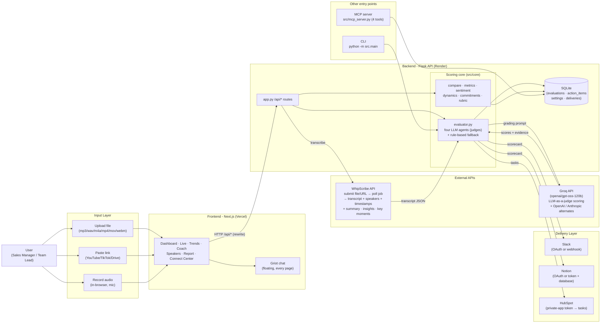

# CallCoach-AI × WhipScribe

[Live APP](https://callcoachai.sujit.top/) ,   [▶ Video demo](https://github.com/Blacksujit/whipscribe-buildathon/blob/track-4-coach-pipeline/apps/blacksujit/track-4/videos/demo/callcoach-demo-2026-09-28T15-11-37.webm) (330MB, right-click "Save As")

Upload a recording, get a scorecard with evidence at the exact second.

---

## The problem

Sarah is a customer-success manager at a B2B SaaS company. She reviews 15-20 customer calls per week. WhipScribe transcribes them — but the transcript is just text.

To assess call quality — did the rep ask the right questions? Make unbacked promises? Capture action items? — Sarah reads every transcript in full (30-60 min/week) and tracks issues in a separate doc. She misses things, feedback is delayed, and coaching is inconsistent.

**Cost:** 5-10 hours/week wasted on manual review. Missed compliance risks. Forgotten action items = lost revenue. No systematic way to track team improvement across calls.

## The solution

CallCoach-AI turns any founder-investor, customer-success, or sales call into a structured quality score with evidence pinned to the exact timestamp. Upload a file, paste a link, or record in the browser. WhipScribe transcribes it. Four AI agents score it. The report shows every flagged quote linked to the moment it was said.

Across multiple calls, the same pipeline shows whether quality is improving, stagnating, or repeating the same mistakes — and produces prescriptive coaching recommendations.
<!-- 
CallCoach keeps the meeting evidence, finds recurring issues across calls, detects metric direction, and produces prescriptive next actions. -->

1. **Score**: Upload a recording — WhipScribe transcribes, four AI agents score on Compliance, Tension, Clarity, and Action Items. Every flagged quote links to the exact second.
2. **Compare**: Analyze 2+ calls — deal velocity, momentum, recurring issue clusters, action-item lifecycle.
3. **Coach**: Prescriptive recommendations tied to evidence from specific calls.

 

## Architecture

One product, four layers. The **dashboard** talks to the **API**, the API calls
two outside services (WhipScribe for transcription, Groq for the LLM judges),
persists everything in SQLite, and pushes the scorecard out to Slack / Notion /
HubSpot.



## Features

One recording in, one scored report out. Transcription is the on-ramp, not the
product — the product is the judgment.

### 👨‍⚖️ LLM as the judge

The transcript is not summarized. It is graded against a rubric by four
specialist agents, each a focused judge on one dimension:

- **Compliance** — were commitments, claims, and promises checked and tracked?
- **Tension** — where did a participant hedge, deflect, or tighten on valuation?
- **Clarity** — was the ask clear up front, the narrative consistent, the
  traction concrete?
- **Action Items** — what was promised, by whom, and will any of it land?

They score, they don't regurgitate the call.

### 🔄️ Four agents, one report

The four scores fold into a single scorecard: an overall number, four
category bars, the one **primary risk** (the issue that cost the most points),
and every flagged quote with its speaker and timestamp. Quotes that cannot be
matched to a real transcript segment are dropped — no fabricated evidence and
no guess at a timestamp. The report links each issue to the exact second in
the recording so you can listen to it once instead of reading the whole call.

### 🏄 Coaching intelligence

A single call gives a diagnosis. Multiple calls give a trend line:

- **Deal velocity** — how fast commitments close across calls.
- **Momentum** — is the pitch sharpening on feedback, or repeating the same
  flaw (the founder's blind spot, surfacing every time)?
- **Recurring issue clusters** — the same problem, called out across calls,
  with the quotes that prove it.
- **Speaker-level risk** — coach the founder and their co-founder separately
  when the diarization is reliable.

The Coach page turns that into prescriptive next actions, each tied to a real
quote from a specific call.


 

### The workflow

```
Recording → WhipScribe API (transcribe w/ speakers + timestamps) → 4-agent AI scoring → Evidence-backed report → Cross-call trends + coaching insights
```

One flow, end to end. WhipScribe handles transcription. CallCoach handles judgment.

## Screenshots

| Dashboard | Trends | Coach | Speakers | Connections |
|-----------|--------|-------|----------|-------------|
|  |  |  |  |  |

## Quick start

```bash
# 1. Backend (Flask API)
cd apps/blacksujit/track-4  # or this directory if you cloned the standalone repo
python -m venv .venv && source .venv/bin/activate  # Windows: .venv\Scripts\activate
pip install -r requirements.txt
cp .env.template .env  # add your WHIPSKRIBE_API_KEY and GROQ_API_KEY
python app.py
# Health check: curl http://localhost:5000/api/health

# 2. Frontend (Next.js dashboard)
cd frontend
npm install
npm run dev:hmr    # webpack dev server with HMR
# Open http://localhost:3000

# 3. CLI (no servers needed)
python -m src.main --sample                     # offline demo with sample transcript
python -m src.main --file ./my-recording.mp3    # upload and analyze
python -m src.main --job-id <whipscribe-id>     # analyze an existing job

# 4. MCP server (for Claude Code / Cursor / ChatGPT)
python src/mcp_server.py
```

### Offline test (no API keys)

```bash
python e2e_test.py --offline          # full pipeline with sample transcript
python -m src.main --compare-sample   # multi-meeting trend demo
```

## Environment variables

| Variable | Required | Purpose |
|---|---|---|
| `WHIPSKRIBE_API_KEY` | yes | Transcription API key |
| `GROQ_API_KEY` | for LLM mode | GROQ API key for 4-agent scoring |
| `LLM_PROVIDER` | no | `groq` (default), `openai`, `anthropic` |
| `SLACK_WEBHOOK_URL` | no | Slack delivery |
| `NOTION_TOKEN`, `NOTION_DATABASE_ID` | no | Notion delivery |

See `.env.template` for all variables.

## Deploy

### Frontend (Vercel — production build verified)

The Next.js build uses `--webpack` (bypasses Turbopack native binary issues on restricted machines) and `@next/swc-wasm-nodejs` for SWC on WASM.

```bash
cd frontend
npm run build    # cross-env NODE_OPTIONS=--max-old-space-size=2048 next build --webpack
npm start
```

Deployed at: [Live](https://callcoachai.sujit.top/)

### Backend (Render)

`render.yaml` and `Procfile` are configured. Set `WHIPSKRIBE_API_KEY`, `GROQ_API_KEY`, `FRONTEND_URL`, and `CORS_ORIGINS` in the Render dashboard.

---


## What works

- Real transcription via WhipScribe API (upload, poll, fetch result with speakers + timestamps)
- Four-agent LLM scoring (GROQ `openai/gpt-oss-120b`) with rule-based fallback
- Evidence-grounded quotes with verified timestamps
- Cross-call trend analysis: velocity, momentum, recurring issues, action-item lifecycle
- Speaker-level risk scoring and coaching insights
- Slack + Notion integrations with live validation
- MCP server with 4 tools for assistant integration
- CLI for offline pipeline execution
- Vercel production deployment with all 8 routes prerendered

## What doesn't work yet

- No real user has tested it — everything is engineer-verified
- Synchronous upload polling (long recordings hold the request open)
- No authentication on the API
- SQLite on free tiers is ephemeral
- Speaker diarization quality depends on WhipScribe's output

---

## Tech stack

| Layer | Technology |
|---|---|
| Frontend | Next.js 16, React 19, React Bits (motion), vanilla CSS |
| Backend | Python Flask, SQLite, gunicorn |
| Transcription | WhipScribe API |
| LLM | GROQ (openai/gpt-oss-120b), with OpenAI/Anthropic support |
| Deployment | Vercel (frontend), Render (backend) |
| MCP | Python MCP server (stdlib) |

---

*Built on the [WhipScribe API](https://whipscribe.com/docs). Own account, own recordings.*
